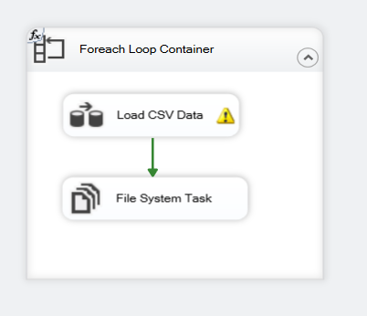
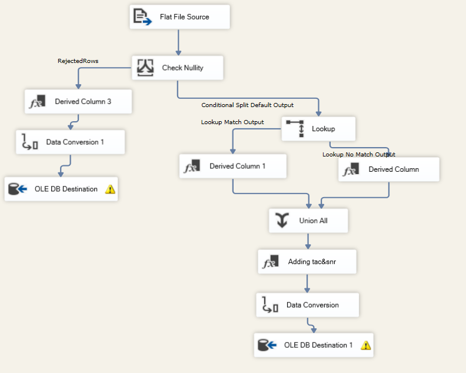

# Telecom DWH

ETL pipeline project built with **SQL Server Integration Services (SSIS)** to process telecom transaction CSV files, validate and transform the data, load valid records into a fact table, store rejected records separately, and move processed files to an archive folder.

## Project Overview

A telecom company generates CSV files every 5 minutes containing customer transaction data.
This project automates the loading process by:

* reading CSV files from a source folder
* validating mandatory fields
* transforming IMEI into TAC and SNR
* converting event timestamps
* looking up subscriber IDs from an IMSI reference table
* loading valid data into the warehouse
* storing rejected rows in an error table
* moving processed files to the processed folder

## Folder Structure

```text
TELECOM DWH/
│
├── Materials (1)/
│   ├── Processed Files/
│   ├── Source Files/
│   └── SQL Queries/
│
├── screenshots/
│   ├── controlflow.png
│   └── dataflow.png
│
├── Telecom DWH/
│   ├── .vs/
│   ├── Telecom DWH/
│   └── Telecom DWH.sln
│
└── README.md
```

## Main Components

### 1. Source Files

CSV transaction files are placed in:

```text
Materials (1)/Source Files/
```

### 2. Processed Files

After successful processing, files are moved to:

```text
Materials (1)/Processed Files/
```

### 3. SQL Queries

Database creation and table scripts are stored in:

```text
Materials (1)/SQL Queries/
```

These scripts are used to create:

* the database
* the fact table
* the IMSI reference table
* the error table

### 4. SSIS Solution

The Visual Studio / SSIS solution is located in:

```text
Telecom DWH/Telecom DWH.sln
```

## ETL Workflow

### Control Flow

The package uses:

* **Foreach Loop Container** to iterate through all CSV files in the source folder
* **Data Flow Task** to process each file
* **File System Task** to move processed files to the processed folder

### Data Flow

The main data flow includes:

* **Flat File Source** to read the CSV file
* **Derived Column** to create:

  * `tac` from the first 8 digits of `imei`
  * `snr` from the last 6 digits of `imei`
* **Data Conversion** to convert `event_ts` to datetime
* **Conditional Split / Null Check** to reject invalid rows
* **Lookup** to retrieve `subscriber_id` from the IMSI reference table
* **Derived Column** after lookup to set `subscriber_id = -99999` if no match is found
* **Union All** to combine rejected rows
* **OLE DB Destination** to load valid rows into the fact table
* **OLE DB Destination** to load rejected rows into the error table

## Validation and Business Rules

The following rules are applied during the ETL process:

* `IMSI` is required, otherwise the row is rejected
* `CELL` is required, otherwise the row is rejected
* `LAC` is required, otherwise the row is rejected
* `EVENT_TS` must be a valid datetime, otherwise the row is rejected
* `IMEI` is split into:

  * `TAC` = first 8 characters
  * `SNR` = last 6 characters
* if `IMSI` is not found in the reference table, `subscriber_id` is set to `-99999`

## Database Tables

### fact_transaction

Stores valid transformed telecom transactions.

### dim_imsi_reference

Stores IMSI values and their related subscriber IDs for lookup.

### error_destination_output

Stores rejected records and related error handling output.

## Screenshots

### Control Flow



### Data Flow



## How to Run the Project

1. Open the solution file:

   ```text
   Telecom DWH/Telecom DWH.sln
   ```

2. Open the SSIS package in Visual Studio.

3. Make sure SQL Server is running and the database scripts have been executed.

4. Verify that the following folders exist:

   * `Materials (1)/Source Files/`
   * `Materials (1)/Processed Files/`

5. Place one or more CSV files inside `Source Files`.

6. Configure connection managers if needed.

7. Run the SSIS package.

8. Check:

   * valid records in the fact table
   * rejected records in the error table
   * processed files moved to `Processed Files`

## Tools and Technologies

* SQL Server
* SSIS
* Visual Studio / SSDT
* CSV files
* SQL scripts

## Future Improvements

* add logging and auditing
* add row count monitoring
* schedule package execution using SQL Server Agent
* improve error reporting

## Author

**Basmala Samir**
